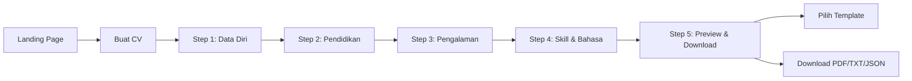

# create-cv-gratis

Bikin CV gratis, langsung jadi PDF. Gak perlu login, gak perlu ribet.


---

## 📋 Daftar Isi

1. [Apa Ini?](#apa-ini)
2. [Quick Install](#quick-install)
3. [Fitur](#fitur)
4. [Flow Penggunaan](#flow-penggunaan)
5. [Teknologi](#teknologi)
6. [Database](#database)
7. [Security](#security)
8. [Cron Job](#cron-job)
9. [FAQ](#faq)
10. [Lisensi](#lisensi)

---

## Apa Ini?


Web app buat bikin CV online. Isi data diri, pendidikan, pengalaman kerja, skill. Langsung download PDF. Data disimpan otomatis.

**Gratis. Tanpa login. Tanpa watermark.**

---


## Quick Install

### Prasyarat

- PHP 8.1+
- MySQL/MariaDB 5.7+
- Composer
- Shared hosting atau VPS

### Step by Step

```bash
# 1. Clone repository
git clone https://github.com/username/create-cv-gratis.git
cd create-cv-gratis

# 2. Install dependency (production aja)
composer install --no-dev

# 3. Copy environment file
cp .env.example .env

# 4. Edit .env - isi konfigurasi database & URL
#    database.default.hostname = localhost
#    database.default.database = nama_database_anda
#    database.default.username = username_database
#    database.default.password = password_database
#    app.baseURL = https://domain-anda.com/

# 5. Import database
#    Buka phpMyAdmin atau CLI:
mysql -u username -p nama_database < docs/database.sql

# 6. Set permission folder
chmod 755 writable/
chmod 755 public/storage/pdf-cache/
chmod 600 .env

# 7. Setup cron job (opsional)
#    Tambahkan ke crontab:
#    0 3 * * * curl -s "https://domain.com/cron/cleanup?secret=YOUR_SECRET" > /dev/null
```

### Konfigurasi Hosting

- **Document root** arahkan ke folder `public/`
- **PHP memory limit** minimal 96MB
- **HTTPS** wajib aktif
- **Ekstensi PHP** yang dibutuhkan: `gd`, `mbstring`, `intl`, `curl`, `mysqli`

---

## Fitur

| Fitur | Keterangan |
|-------|-------------|
| **5 Template CV** | Classic, Modern, Sidebar, Minimalist, Professional |
| **Live Preview** | Liat hasil langsung saat ngetik |
| **Auto-save** | Data gak ilang walau ketiduran |
| **Download PDF** | Bisa cetak atau share |
| **Download TXT** | Buat screen reader atau backup simpel |
| **Download JSON** | Backup data lengkap |
| **Cache PDF** | Download berulang jadi lebih cepet |
| **Upload Foto** | Resize & kompres otomatis (max 200KB) |
| **Overflow Detection** | Peringatan kalo CV kepanjangan |
| **Mobile Friendly** | Bisa dari HP 360px |
| **Aksesibel** | Support screen reader, keyboard, high contrast mode |

### Rate Limit (Biar Gak Disalahin)

| Action | Limit |
|--------|-------|
| PDF download | 3x per menit, 10x per jam, 30x per hari |
| TXT/JSON download | 5x per menit |
| Auto-save | 30x per menit |
| Preview | 20x per menit |

---

## Flow Penggunaan



**Penjelasan detail:**

1. **Buka website** → liat template showcase + testimoni
2. **Klik "Buat CV Gratis"** → langsung masuk form
   - Session otomatis kebentuk (gak perlu register)
   - Cookie berlaku 30 hari
3. **Isi step by step:**
   - **Step 1:** Nama, email, telepon, alamat, foto (opsional)
   - **Step 2:** Pendidikan (institusi, jurusan, tahun, IPK)
     - Bisa tambah banyak entry
   - **Step 3:** Pengalaman kerja (perusahaan, posisi, periode, deskripsi)
     - Bisa tambah banyak entry
     - Deskripsi pake format poin-poin
   - **Step 4:** Skill + level, Bahasa + level
   - **Step 5:** Preview CV, pilih template, download
4. **Data auto-save** setiap kali berhenti ngetik (debounce 2 detik)
5. **Ganti template** kapan aja → preview langsung update
6. **Kalo overflow** (kebanyakan isi) → dapat peringatan + rekomendasi ganti template
7. **Download PDF** → file masuk ke folder download komputer
8. **Balik lagi besok** → data masih ada (selama 30 hari)

**Gak perlu daftar. Gak perlu login. Gas langsung.**

---

## Teknologi

### Backend

- **Framework:** CodeIgniter 4.5+
- **Database:** MySQL 5.7+ / MariaDB 10.3+
- **PDF Generator:** Dompdf 2.0+
- **PHP Extensions:** `gd`, `mbstring`, `intl`, `curl`, `mysqli`

### Frontend

- **CSS:** Vanilla CSS (mobile-first, no framework)
- **JavaScript:** Vanilla ES6+ (no jQuery, no React, no Vue)
- **Font:** Local (dejavu-sans buat PDF, system font buat web)

### Storage

- **Session:** Database + file based (fallback)
- **Cache PDF:** File system (auto-clean 1 jam)
- **Upload foto:** `writable/uploads/photos/`

---

## Database

### Skema (5 tabel)

```sql
-- 1. Session pengguna anonim
cv_sessions
├── session_token (UUID, unique)
├── fingerprint_hash (buat deteksi abuse)
├── current_step, selected_template
├── pdf_generated_count
└── expires_at (30 hari)

-- 2. Data CV (JSON per section)
cv_data
├── session_id (FK ke cv_sessions)
├── section_name (personal/education/experience/skills/languages)
├── data_json (MEDIUMTEXT)
└── character_count (buat overflow detection)

-- 3. Log download + cache
export_logs
├── export_format (pdf/txt/json)
├── content_hash (buat cache lookup)
├── cache_path (kalo PDF)
└── was_cached (flag)

-- 4. Rate limiting
rate_limits
├── key_identifier (session + action + window)
├── hit_count
└── window_start

-- 5. Abuse reports (auto-log)
abuse_reports
├── ip_address, session_id
├── action_attempted, reason
└── request_data (sanitized)
```

### Cleanup Otomatis

```sql
-- Event MySQL (kalo support)
CREATE EVENT cleanup_expired_sessions
ON SCHEDULE EVERY 1 DAY
DO
  DELETE FROM cv_sessions WHERE expires_at < NOW();
```

Atau pake cron job (kalo hosting gak support event).

---

## Security

### Perlindungan yang Dipasang

| Layer | Implementasi |
|-------|---------------|
| **CSRF** | Token di semua form + AJAX header |
| **XSS** | Semua output pake `esc()` helper |
| **SQL Injection** | Query Builder + prepared statement |
| **Rate Limiting** | Per session + per IP |
| **File Upload** | Validasi MIME, resize, rename, limit size |
| **Session** | HttpOnly, Secure, SameSite=Lax |
| **Headers** | CSP, X-Frame-Options, X-Content-Type-Options |

### Anti-Abuse

- **Fingerprinting:** Kombinasi User-Agent + Accept-Language + subnet IP
- **Honeypot:** Field tersembunyi buat nangkep bot
- **Auto-flag:** 5+ pelanggaran → session di-flag, export diblokir
- **IP Block:** 200+ request per 10 menit → blok sementara 30 menit

### Data Retention

- CV data: **30 hari** (auto-delete)
- Rate limit logs: **1 jam** (auto-clean)
- Cache PDF: **1 jam** (auto-delete)
- Abuse reports: **disimpan permanen** (buat review manual)

---

## Cron Job

**Wajib** di-set biar database gak membengkak.

```bash
# Jalankan tiap hari jam 3 pagi
0 3 * * * curl -s "https://domain-anda.com/cron/cleanup?secret=RAHASIA_ANDRA" > /dev/null
```

**Yang dibersihin:**
- Session expired (>30 hari)
- Rate limit records (>1 jam)
- File cache PDF orphan (gak ada di database)
- Foto profil yang session-udah expired

**Cara dapetin secret:**
```bash
# Generate pake PHP
php -r "echo bin2hex(random_bytes(32));"
# Copy hasilnya ke .env -> CCG_CRON_SECRET
```

---

## FAQ

### Data saya aman?

Aman. Gak ada password yang bocor karena emang gak pake login. Data cuma disimpan 30 hari, habis itu auto hapus.

### Bisa dari HP?

Bisa banget. Layout udah dibuat mobile-first dari awal. Minimal layar 360px (HP 5 inci) tetep keliatan semua.

### Ada watermark di PDF?

Gak ada. PDF bersih, professional.

### Bisa edit PDF yang udah di-download?

PDF buat cetak/share. Kalo mau edit, balik lagi ke web aja. Data lo masih nyimpen 30 hari.

### Beda template apa aja?

| Template | Cocok buat | Maks Pengalaman | Fitur Foto |
|----------|-----------|-----------------|-------------|
| Classic | Fresh graduate, entry level | 6 item | ✅ |
| Modern | Professional 2-5 tahun | 8 item | ✅ |
| Sidebar | Fresh grad dengan banyak skill | 4 item | ✅ |
| Minimalist | Senior executive | Unlimited | ❌ |
| Professional | 5+ tahun experience | 12 item | ✅ |

### Kok ada limit download PDF?

Supaya server gak kewalahan. 3x per menit + 30x per hari itu lebih dari cukup buat normal user.

### CV-ku kepanjangan gimana?

Tampil peringatan. Lo bisa:
- Pilih template Minimalist (gak ada batas)
- Hapus beberapa item
- Atau cuekin aja (tetep bisa download, tapi mungkin kelebihan halaman)

### Butuh internet buat pake?

Iya. Web app ini butuh koneksi internet. Tapi setelah download PDF, file-nya bisa lo simpen offline.

### Bisa pake foto dari galeri HP?

Bisa. Upload foto, nanti di-resize & kompres otomatis ke 400x400 pixel, maks 200KB.

### Ada support screen reader?

Ada. Udah pake ARIA labels, landmark roles, skip link, dan high contrast mode. Juga ada voice guide buat bantu navigasi.

---

## Lisensi

MIT License - bebas dipake, diubah, dijual. Cuma jangan lupa credit aja ke project ini.

---

**Dibuat dengan** 💻 + ☕ + 📄 buat siapapun yang butuh CV cepat, gratis, dan gak repot.

**Pertanyaan?** Buka issue aja di GitHub.
```
